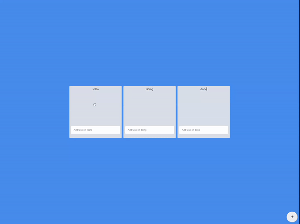
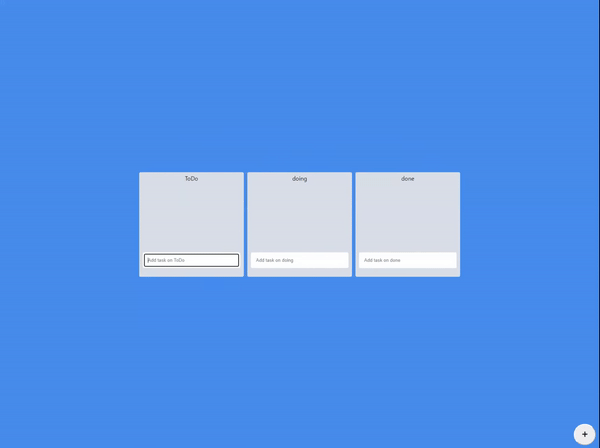
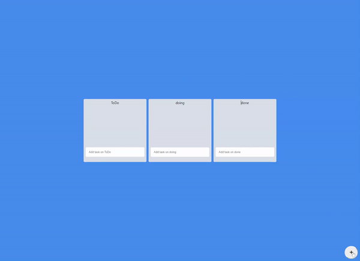

# Drag and Drop을 적용해 DoTo List 만들기

[페이지 바로가기](https://yongjin-jo.github.io/trello-clone/)

### 사용한 라이브러리

- react-hook-form
- recoil
- styled-components
- react-beautiful-dnd

## 주요 기능

### Board 컴포넌트 Drag and Drop 적용

### Card 컴포넌트 Drag and Drop 적용

### 새로운 Board 생성

## 기타 기능

- 로컬 스토리지 저장 기능

- List 추가 기능
  react-hook-form을 이용하여 form을 구현했습니다. form data는 상태관리 store에 저장됩니다.

## 구현 해야 할 목록

- [ ] 삭제 기능

### 배운 점

상태관리를 사용하면 자식에서 부모로 데이터를 전달할 때 와 부모에서 자식에게 데이터를 전달할 때 prop을 거치치 않고 간편하게 전달 할수 있었습니다.

dnd 라이브러리를 통해 보다 쉽게 dnd를 경험할 수 있었습니다. 하지만 이러한 라이브러리를 사용하면 보다 편하게 사용할수 있겠지만 원리를 파악하지 않고 사용했기 때문에 커스텀이 필요할시 사용하기 힘들꺼 같습니다. 나중에 기회가 되면 VanillaJs로 직접 구현해보는 시간을 가져야 겠습니다.
